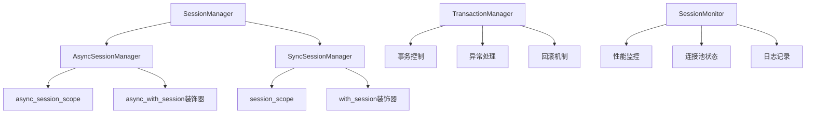

# Session上下文管理器架构设计

## 1. 核心组件设计



## 2. 主要特性

1. **双模式支持**：同时支持同步和异步操作
2. **自动事务管理**：自动提交成功的事务，异常时自动回滚
3. **连接池管理**：复用现有的数据库连接池配置
4. **异常处理**：完善的异常捕获和处理机制
5. **性能监控**：记录session使用情况和性能指标
6. **装饰器支持**：提供便捷的装饰器用法
7. **嵌套事务支持**：支持嵌套的session使用场景

## 3. 使用场景

- **异步场景**：FastAPI路由、异步任务处理
- **同步场景**：数据迁移脚本、批量处理任务
- **混合场景**：在同一个应用中同时使用两种模式

## 4. 核心接口设计

### 异步模式
```python
# 异步上下文管理器
async with async_session_scope() as session:
    # 数据库操作
    result = await session.execute(select(User))
    await session.commit()

# 异步装饰器
@async_with_session
async def create_user(session: AsyncSession, name: str):
    user = User(name=name)
    session.add(user)
    return user
```

### 同步模式
```python
# 同步上下文管理器  
with session_scope() as session:
    # 数据库操作
    result = session.execute(select(User))
    session.commit()

# 同步装饰器
@with_session  
def create_user(session: Session, name: str):
    user = User(name=name)
    session.add(user)
    return user
```

## 5. 错误处理策略

- **自动回滚**：任何未捕获的异常都会触发回滚
- **日志记录**：记录所有数据库操作和异常信息
- **重试机制**：对于连接失败等临时性错误提供重试
- **优雅降级**：在极端情况下提供备用处理方案

## 6. 性能优化

- **连接复用**：充分利用SQLAlchemy的连接池
- **懒加载**：按需创建session实例
- **资源清理**：确保session和连接的及时释放
- **监控指标**：提供详细的性能监控数据

## 7. 实现细节

### 7.1 异步Session管理器
- 基于 `AsyncSession` 和 `async_sessionmaker`
- 支持异步上下文管理器协议
- 集成现有的 `get_db()` 依赖注入

### 7.2 同步Session管理器
- 基于传统的 `Session` 和 `sessionmaker`
- 支持同步上下文管理器协议
- 为批量处理和脚本提供支持

### 7.3 事务管理
- 自动开始事务
- 成功时自动提交
- 异常时自动回滚
- 支持嵌套事务（savepoint）

### 7.4 监控和日志
- 记录session创建和销毁
- 监控事务执行时间
- 记录异常和回滚信息
- 提供连接池状态监控

## 8. 配置选项

```python
class SessionConfig:
    auto_commit: bool = True          # 是否自动提交
    auto_rollback: bool = True        # 是否自动回滚
    enable_monitoring: bool = True    # 是否启用监控
    log_level: str = "INFO"          # 日志级别
    retry_attempts: int = 3          # 重试次数
    retry_delay: float = 1.0         # 重试延迟
```

## 9. 兼容性

- 与现有的 `get_db()` 函数兼容
- 不影响现有的FastAPI依赖注入
- 可以逐步迁移现有代码
- 支持混合使用新旧方式

## 10. 测试策略

- 单元测试：测试各个组件的功能
- 集成测试：测试与数据库的集成
- 性能测试：测试连接池和事务性能
- 异常测试：测试各种异常情况的处理